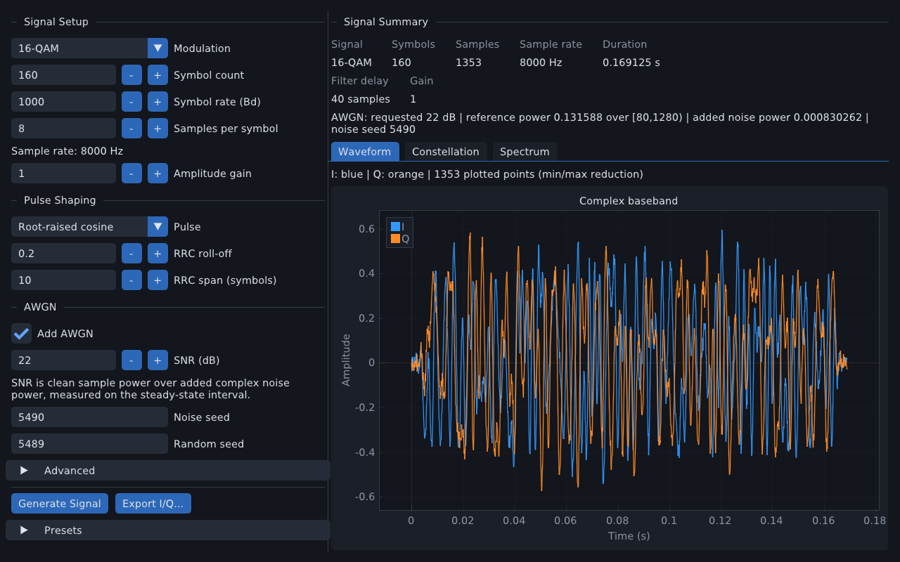
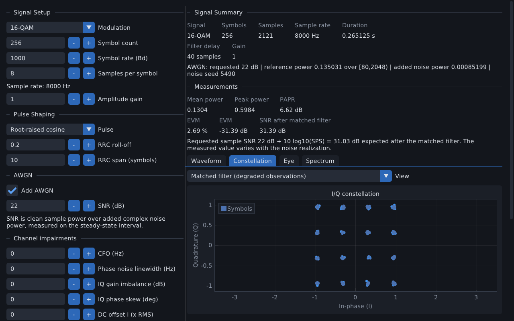
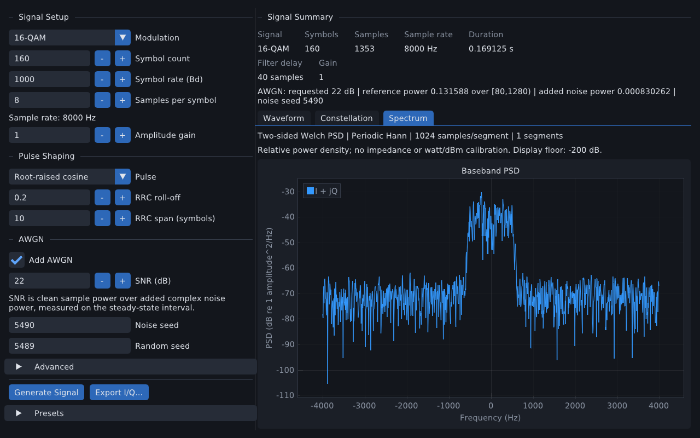
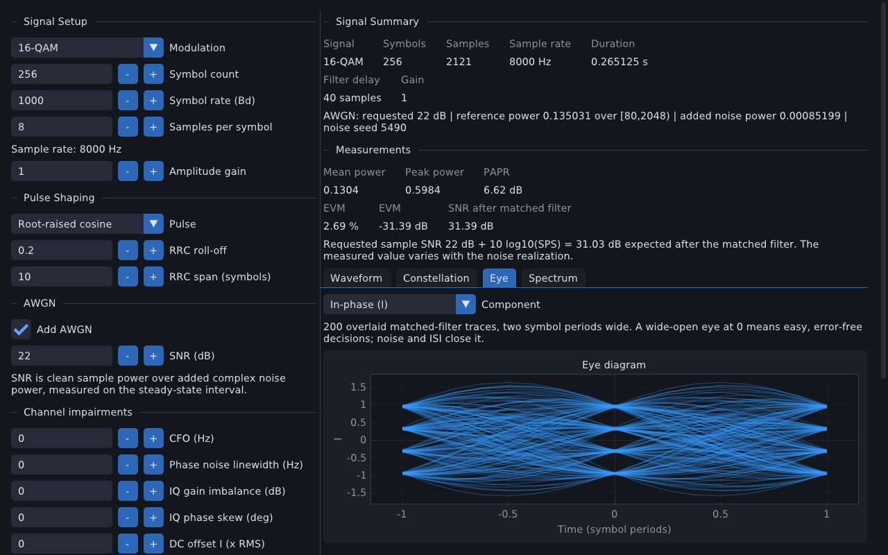
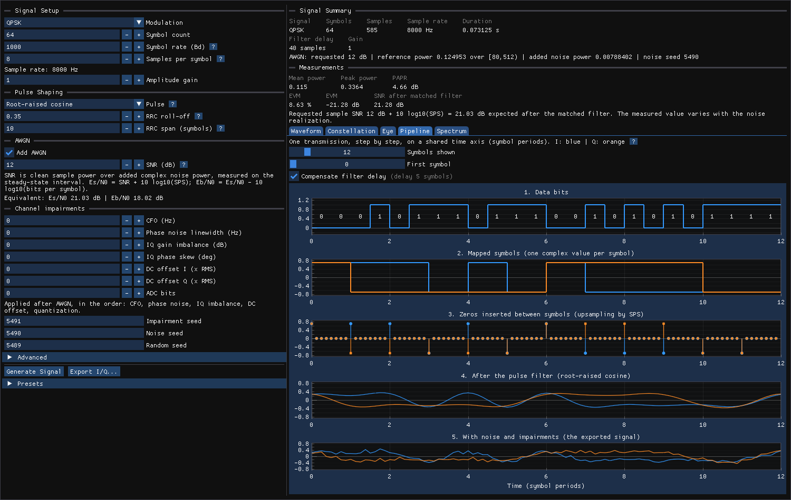
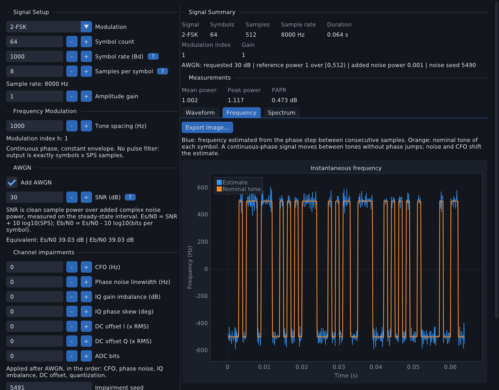
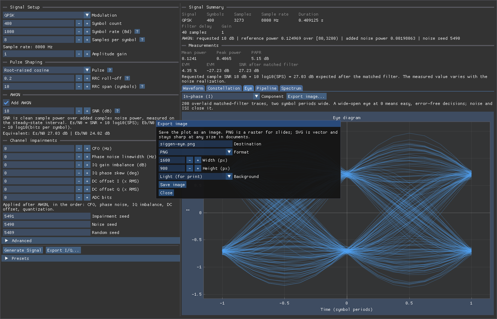

# Siggen

[](https://github.com/ronnymilleo/siggen/actions/workflows/ci.yml)

A C++23 signal generator with a command-line interface and optional ImGui/ImPlot
GUI. Generate reproducible complex I/Q samples for BPSK, QPSK, OQPSK, pi/4-DQPSK,
DBPSK, DQPSK, 8-PSK, 8-DPSK, 4-ASK, OOK, 4-PAM, 16/32/64/256-QAM, 2-FSK, 4-FSK, MSK,
and complex white Gaussian noise (WGN), with optional AWGN and simple channel
impairments on linear signals; inspect waveforms, constellations, eye diagrams,
a two-sided spectrum and measurements (PAPR, EVM, measured SNR); work through
guided lesson presets; save presets; export single signals; and
generate swept fixed-length frame datasets (`siggen batch`) for classifier
training. This application generates complex baseband, not an RF carrier.

<div align="center">
  
  <p align="center"><em>Waveform - 16-QAM, RRC pulse shaping, 22 dB SNR</em></p>

  
  <p align="center"><em>Constellation - matched-filter observations</em></p>

  
  <p align="center"><em>Spectrum - two-sided Welch PSD</em></p>

  
  <p align="center"><em>Eye - overlaid symbol-period traces</em></p>

  
  <p align="center"><em>Pipeline - bits to transmitted samples, step by step</em></p>
</div>

## Build and test

Requirements: CMake 3.28+, a C++23 compiler and standard library (including
`std::ios::noreplace`), and Ninja for the commands below. Vendor dependencies are
pinned Git submodules; no dependency download occurs during CMake configuration.

```sh
git submodule update --init --recursive
cmake --workflow --preset dev
./build/dev/bin/siggen --gui
```

Use CMake presets for documented builds and agent validation. Each workflow runs
configure → build → test; individual steps are also available:

```sh
cmake --preset dev
cmake --build --preset dev
ctest --preset dev
```

| Preset | Build | GUI | Compiler | Sanitizer |
|---|---|---|---|---|
| `dev` | Debug | Yes | System default | None |
| `release` | Release | Yes | System default | None |
| `headless` | Debug | No | System default | None |
| `headless-release` | Release | No | System default | None |
| `clang-headless` | Debug | No | Clang (Linux) | None |
| `asan` | Debug | No | GCC (Linux) | Address + undefined behavior |
| `tsan` | Debug | No | GCC (Linux) | Thread |

All profiles enable tests and project warnings. Configure, build, test, and
workflow names match and share `build/<preset-name>`. Tests print failures and
fail if no tests are discovered. Discovery happens at test time, so linking a
test executable does not execute it.

The headless executable, library, and tests need no graphics libraries. GoogleTest is included
only when `SIGGEN_BUILD_TESTS=ON`; Threads is discovered only for the executable, GUI, or tests.
The GUI requires OpenGL and the platform development libraries used by the pinned
GLFW. On Linux its default backend is X11, which also runs through XWayland.
GLFW examples, tests, documentation, and installation default off. GoogleMock and ImGui/ImPlot demo sources are excluded from default builds.

Executables are in the build directory's `bin/`, libraries in `lib/`, and
`compile_commands.json` stays in the build directory. In-source builds are
rejected. `SIGGEN_ENABLE_WARNINGS` controls compiler-appropriate warnings on project
targets. If clang-format is available, `cmake --build --preset dev --target format`
explicitly formats project sources; ordinary builds never rewrite sources.

### Local overrides and library-only builds

Keep machine-specific compiler paths and parallelism in ignored
`CMakeUserPresets.json`. Local names must differ from the checked-in presets;
inheritance gives each new name its own build directory. For example:

```json
{
  "version": 6,
  "configurePresets": [
    {
      "name": "local-clang",
      "inherits": "clang-headless",
      "cacheVariables": { "CMAKE_CXX_COMPILER": "/usr/bin/clang++" }
    },
    {
      "name": "library-only",
      "inherits": "headless",
      "cacheVariables": { "SIGGEN_BUILD_APP": "OFF", "SIGGEN_BUILD_TESTS": "OFF" }
    }
  ],
  "buildPresets": [
    { "name": "local-clang", "configurePreset": "local-clang", "jobs": 4 },
    { "name": "library-only", "configurePreset": "library-only", "jobs": 4 }
  ],
  "testPresets": [
    { "name": "local-clang", "inherits": "clang-headless", "configurePreset": "local-clang" }
  ],
  "workflowPresets": [
    {
      "name": "local-clang",
      "steps": [
        { "type": "configure", "name": "local-clang" },
        { "type": "build", "name": "local-clang" },
        { "type": "test", "name": "local-clang" }
      ]
    }
  ]
}
```

Run `cmake --workflow --preset local-clang`. To build only the signal library,
run `cmake --preset library-only` followed by `cmake --build --preset library-only`;
this needs no vendor submodules and has no test step. `SIGGEN_BUILD_APP` controls
the executable; `SIGGEN_BUILD_GUI` controls its optional graphical interface. For a local
GUI or Release Clang profile, inherit `dev` or `release` and set the compiler path.
CMake 3.28 supports these built-in [workflow presets](https://cmake.org/cmake/help/v3.28/manual/cmake-presets.7.html).

## Command line and logging

There is one application executable, `siggen`. With no arguments it generates
the default BPSK signal and exports `signal.csv` plus `signal.csv.json` in the
current directory, then exits. Use `--gui` to open the desktop interface instead:

```sh
./build/dev/bin/siggen
./build/dev/bin/siggen --output captures/example.csv
./build/dev/bin/siggen --output signal.csv --overwrite
./build/dev/bin/siggen --modulation 64-QAM --symbols 512 --sps 4 --format cf32
./build/dev/bin/siggen --modulation qpsk --snr-db 10 --noise-seed 7 -o noisy.csv
./build/dev/bin/siggen --modulation wgn --samples 8192 --sample-rate 16000 --noise-power 2
./build/dev/bin/siggen --preset custom.preset --gain 2 --output preset.csv
./build/dev/bin/siggen --gui --preset custom.preset
./build/dev/bin/siggen --gui --log-level debug
./build/dev/bin/siggen --help
./build/dev/bin/siggen --version
```

Configuration resolves as **defaults → loaded preset → explicitly supplied CLI
options**, then validates through the shared library; options that were not
supplied never replace preset values. Modulation names (`BPSK`, `QPSK`, `8-PSK`,
`16-QAM`, `32-QAM`, `64-QAM`, `256-QAM`, `OOK`, `4-PAM`, `DBPSK`, `DQPSK`,
`pi/4-DQPSK`, `8-DPSK`, `OQPSK`, `4-ASK`, `2-FSK`, `4-FSK`, `MSK`, `WGN`) are accepted case-insensitively; pulse names are
`rrc` and `rectangular`. Signal options are `--preset`, `--modulation`,
`--symbols`, `--symbol-rate`, `--sps`, `--pulse`, `--roll-off`, `--span`,
`--tone-spacing-hz` (2-FSK and 4-FSK only), `--gain`, `--seed`,
`--data-source random|explicit`, and `--bits`. Noise options
are `--samples`, `--sample-rate`, `--noise-power`, `--noise-seed`, and
`--snr-db <dB>|off`; `--snr-db off` disables preset-provided AWGN. Channel
impairment options for linear waveforms are `--cfo-hz`, `--phase-noise-hz`,
`--iq-gain-db`, `--iq-phase-deg`, `--dc-i`, `--dc-q`, `--adc-bits`, and
`--impairment-seed` (see "Channel impairments"). Export
options are `--format csv|cf32`, `--output`/`-o`, and `--overwrite`. Without an
output path, CSV uses `signal.csv` and binary uses `signal.iq`.

Options incompatible with the selected waveform are rejected: noise-source
options require `--modulation WGN`, and linear options (including `--snr-db`)
are rejected for WGN. Pulse options (`--pulse`, `--roll-off`, `--span`) are
rejected for FSK and MSK, which have no pulse filter, and `--tone-spacing-hz`
is rejected for every other waveform (MSK fixes the spacing). Switching waveform families through `--modulation` starts
from that family's defaults while retaining gain and seeds; incompatible preset
fields never silently become active. `--bits` selects explicit input unless a
conflicting `--data-source random` was explicitly supplied. Preset and signal
options may initialize the GUI (`--gui`) without generating; export options and
the `batch` subcommand cannot be combined with `--gui`. The destination's parent
directory must exist, and existing sample or metadata files are protected unless
`--overwrite` is specified. Generation or export errors return a nonzero exit
status.

The GUI keeps the generator controls and plots inside the main application
window, including on Wayland. The content follows window resizing and scrolls
when needed; detached platform windows and saved floating-panel positions are
disabled.

### Batch dataset generation

`siggen batch` sweeps waveform, seed, and SNR lists and writes fixed-length
frames into a new output directory, sharing preset loading and applicable
signal overrides with single generation:

```sh
./build/dev/bin/siggen batch --modulations BPSK QPSK 8-PSK 16-QAM 64-QAM WGN \
  --seeds 42 43 --snrs-db=-10,0,10 \
  --frame-size 2048 --frames-per-point 100 \
  --output-dir dataset --format cf32
```

Batch defaults are the resolved waveform and seed (or the explicit lists), one
frame per point, 2048 samples, and binary `cf32` frames. Lists preserve user
order and reject duplicates; `--snrs-db` accepts a comma-separated list (use the
`--snrs-db=-10,0,10` form for negative values). Without an SNR list, the
resolved single-signal noise setting is retained. WGN ignores the SNR axis: it
is generated once per seed and frame at the configured power with a null SNR
label. Batch linear input is always seeded random data; `--bits`,
`--data-source`, `--symbols`, and `--samples` are rejected because the frame
size determines generation length, and batch `--overwrite` is rejected.
Put preset, signal, and format options after `batch`; root options before the
subcommand are rejected except for the global `--log-level`. Mixed waveform
lists accept options for either included family. A preset supplies its active
family's settings; other families start from defaults before CLI overrides.

Each linear frame of length `F` is generated from `N = ceil(F / SPS)` payload
symbols plus `G = span_symbols` RRC guard symbols on each side (rectangular
frames need no guards), then cropped to `F` samples beginning at
`G * SPS + filter_delay_samples`. AWGN is applied after cropping with the
reference power measured over the retained clean frame. Frame timestamps start
at zero; the sidecar records the crop offset and original filter delay
separately. WGN frames generate `F` samples directly. Frames are produced
sequentially, holding only one frame in memory.

Per-frame seeds derive deterministically through `std::seed_seq` from
`{base seed, waveform ID, frame index, stream tag}` with fixed tags `data = 1`
and `noise = 2`; noise derivation additionally includes the configured noise
seed. Waveform IDs are fixed explicitly in the descriptor table: BPSK 0,
QPSK 1, 8-PSK 2, 16-QAM 3, 64-QAM 4, WGN 5. Reordering the table or enum does
not change these IDs. SNR is deliberately excluded from seed derivation, so all SNR
points of one (waveform, seed) sweep share the same underlying data and noise
realizations.

The output directory must not exist; existing directories are never touched.
Files are named `frame_<point>_<frame>` with zero-padded indices preserving
user list order, each with a JSON sidecar (`<file>.json`). A versioned
`manifest.jsonl` starts with a `batch_header` record, gains one `frame`
completion record (relative path, waveform, axis values, derived seeds, frame
size, format, and crop/noise provenance) appended and flushed only after that
frame's files close successfully, and ends with a `summary` record marked
`completed`. A request is capped at 100,000 frames and retains the per-
generation symbol/sample limits, including guard symbols; the complete sweep and
all size arithmetic are validated before any output is created. Generation or
write errors fail fast with a nonzero exit status and preserve completed
frames; an interrupted run simply lacks its completion summary, and files
without completion records are not advertised as valid. Resume and automatic
cleanup are not implemented.

AWGN metadata represents the half-open reference interval as a JSON object:
`{"begin": 0, "end": 2048}` includes sample 0 and excludes sample 2048.
Preflight rejects zero-gain AWGN and SNR ratios that overflow or underflow.
Sample-dependent numerical failures remain generation errors and follow the
same incomplete-run rules as write failures.

Both `dev` and `release` produce the same dual-mode executable. The `headless`
presets build `siggen` without graphics dependencies; `--gui` then reports that
GUI support was not compiled in. The former `imsignalgenerator` executable is now
named `siggen`; old build artifacts are not removed automatically.

[CLI11 v2.6.2](https://github.com/CLIUtils/CLI11/releases/tag/v2.6.2) is pinned as a
Git submodule. It parses options before graphics initialization, so help, version,
and argument errors work without a display and do not generate output files.
Invalid levels, missing values, and unknown options fail with a usage error.

spdlog writes timestamped, leveled console logs to stderr (color when supported).
`--log-level` accepts `trace`, `debug`, `info`, `warn`, `error`, `critical`, or `off`.
The CLI level takes precedence over `SPDLOG_LEVEL`; the environment variable
remains a fallback, followed by the default `info`. Debug adds initialization and
generation-start details. For example:

```sh
./build/headless/bin/siggen --output signal.csv --log-level debug
```

Use `--log-level warn` for warnings and errors or `--log-level off` for silence.
Redirect stderr to keep a log file if needed. Logs include paths for preset/export
operations but do not dump I/Q samples or explicit input bits. Logging is
synchronous with a thread-safe sink; warnings and errors flush immediately.
GUI errors remain visible, and per-frame validation does not generate logs.
CLI11 and spdlog are used by both application modes, but library-only builds need
neither. Vendor examples, tests, documentation, benchmarks, and installation
default off.

## Using the generator

The generator opens on startup, optionally initialized from `--preset` and
signal options supplied with `--gui`; it does not generate automatically. Enter
modulation, symbol count, symbol rate in baud, samples per symbol (SPS), and
amplitude gain in **Signal Setup**. Choose RRC or rectangular pulses in **Pulse
Shaping**. The **AWGN** section enables additive noise with a requested SNR in
dB; the visible data seed defaults to 5489 and the noise seed to 5490.
**Advanced** selects seeded random bits or exact explicit binary input (up to
eight bits per symbol). Selecting **WGN** replaces the symbol controls with the
noise source: sample count, sample rate, total complex noise power, and noise
seed.

The **Channel impairments** section degrades the signal after AWGN with a
carrier frequency offset, oscillator phase noise, IQ gain and phase imbalance,
DC offsets and an ADC quantizer; every field defaults to off.

**Generate Signal** starts one owned asynchronous job. Editing settings while it
runs affects the next request. The previous result remains visible until a new
result completes; a message identifies settings that differ from that result.
Failed generation preserves the previous result. Closing the application waits
for its pending job. **Signal Summary**, plots and exports describe completed
samples, using their original configuration.

Defaults are BPSK, 256 symbols, 1000 Bd, SPS 8, RRC roll-off 0.2, RRC span 10
symbols, gain 1, random seed 5489, and noise seed 5490; WGN defaults are 2048
samples, 8000 Hz, and unit noise power. Bounds are 1–65536 symbols, SPS 1–32,
span 1–100 symbols, roll-off [0,1], and gain [0,1000000]. RRC requires SPS >= 2
and an even `span * SPS`. Rate must be positive, with finite derived sample rate
and buffer duration. Generation uses checked sizes and a 4,194,304-sample
ceiling, which also bounds WGN sample counts. There is no implicit padding or
truncation of explicit bits: supply exactly `symbol_count * bits_per_symbol`
characters, each `0` or `1` (no whitespace), up to 524,288 bits (65,536 symbols x 8 bits) for 256-QAM.

## Measurements, eye diagram, spectral windows and guided presets

After **Generate Signal** the **Measurements** block reports mean and peak power
and the PAPR over the complete buffer (filter transients included). For linear
signals it also reports the EVM of the matched-filter observations relative to
the gain-scaled ideal symbols, and the corresponding SNR after the matched filter
(`-EVM` in dB). Matched filtering averages noise over about SPS samples, so this
value is the requested sample-level SNR plus `10*log10(SPS)` in expectation; the
GUI shows both numbers and the measured one still varies with the noise
realization. A clean RRC signal shows a small EVM floor (about -43 dB for the
default span 10, roll-off 0.2) from the truncated filter. Noise sources and FSK
signals have power statistics only (no symbol-rate observations to compare).

The **Eye** tab overlays up to 200 matched-filter traces, each two symbol periods
wide and centred on a decision instant, for the I or Q component. Traces cover the
same steady-state symbols as the constellation.

The **Spectrum** tab selects the Welch window: periodic Hann (default),
Hamming, Blackman or Rectangular. Hann output is unchanged from earlier releases.

`presets/` contains numbered guided lessons. Lines beginning with `#` after the
preset header are notes: parsers ignore them and the GUI shows them after
**Load Preset**, so a lesson can say what to look at (for example
`presets/02-qpsk-snr-8db.preset`). Lessons 11–16 cover 2-FSK, MSK, DQPSK under a
carrier offset, 4-PAM, 256-QAM and OOK; lessons 17–21 cover OQPSK, pi/4-DQPSK, 32-QAM, 8-DPSK and 4-ASK. Controls also have hover tooltips, and the symbol rate, SPS, pulse, roll-off, span and SNR controls have a **?** button that opens a longer "what is this?" panel (the SNR panel also shows your current SNR as Es/N0 and Eb/N0).

## Mapping and reproducibility

Mapped symbols have **unit average constellation energy**, before amplitude gain.
A particular random buffer need not have exactly unit empirical symbol energy.
There is no per-buffer renormalization. QPSK has two bits per symbol; 8-PSK
three; 16-QAM four; 32-QAM five; 64-QAM six; 256-QAM eight. Bits are consumed left to right in
symbol order.

| Modulation | Bits | Complex symbol before gain |
|---|---|---|
| BPSK | 0 | +1 + j0 |
| BPSK | 1 | -1 + j0 |
| QPSK | 00 | (+1 + j)/sqrt(2) |
| QPSK | 01 | (+1 - j)/sqrt(2) |
| QPSK | 11 | (-1 - j)/sqrt(2) |
| QPSK | 10 | (-1 + j)/sqrt(2) |

8-PSK uses unit radius and a fixed zero phase origin. At phases `k*pi/4`,
k = 0..7 counterclockwise, the Gray labels are:

| Phase index k | Bits |
|---|---|
| 0 | 000 |
| 1 | 001 |
| 2 | 011 |
| 3 | 010 |
| 4 | 110 |
| 5 | 111 |
| 6 | 101 |
| 7 | 100 |

Every adjacent pair, including the 7→0 wrap-around, differs in exactly one bit.

For 16-QAM, bits `b0 b1` select I and `b2 b3` select Q independently:

| Axis bit pair | Axis level before gain |
|---|---|
| 00 | -3/sqrt(10) |
| 01 | -1/sqrt(10) |
| 11 | +1/sqrt(10) |
| 10 | +3/sqrt(10) |

For 64-QAM, the first three bits select I and the next three select Q. Axis
levels in increasing amplitude order, divided by `sqrt(42)` for unit average
constellation energy:

| Axis bits | Unscaled level |
|---|---:|
| 000 | -7 |
| 001 | -5 |
| 011 | -3 |
| 010 | -1 |
| 110 | +1 |
| 111 | +3 |
| 101 | +5 |
| 100 | +7 |

256-QAM works the same way with four bits per axis: the first four bits select I
and the next four select Q. Each axis uses the binary-reflected Gray label of
the level index, so levels ascend from `-15` to `+15` in steps of 2 and every
level is divided by `sqrt(170)`. These mappings make horizontal/vertical nearest
neighbors differ by one bit. QPSK, 8-PSK and the QAM orders have defined I and
Q components; BPSK Q is zero. Gain scales sample amplitude once; power scales by
gain squared.

### PAM, on-off keying and differential PSK

These use the same pulse-shaped path as the other linear waveforms.

| Waveform | Bits | Symbol before gain |
|---|---|---|
| OOK | 0 / 1 | `0` / `+sqrt(2)` (mean energy 1; the symbols have a non-zero mean, so the spectrum carries a 0 Hz line) |
| 4-PAM | 00, 01, 11, 10 | `-3`, `-1`, `+1`, `+3`, divided by `sqrt(5)` on I; Q is zero |

DBPSK and DQPSK carry the data in the phase *change* between symbols. The
reference phase before the first symbol is 0 for DBPSK and 45 degrees for DQPSK
(so the DQPSK points coincide with the QPSK points). With `phi[k] = phi[k-1] + delta`:

| Waveform | Bits | Phase change `delta` |
|---|---|---|
| DBPSK | 0 / 1 | 0 / +180 degrees |
| DQPSK | 00, 01, 11, 10 | 0, +90, +180, +270 degrees |

The symbol is `exp(j*phi[k])`, so the first bit pair already moves the phase
away from the reference. A receiver recovers the data from `s[k] * conj(s[k-1])`,
which is unchanged by a constant phase rotation of the channel. The
matched-filter constellation of a DQPSK signal with a carrier offset therefore
spins, yet each symbol-to-symbol step stays near its transmitted value.

### 32-QAM, OQPSK and pi/4-DQPSK

**32-QAM** is the cross constellation: the 6 x 6 grid of odd levels
`-5, -3, -1, +1, +3, +5` on each axis without its four corner points, divided by
`sqrt(20)` for unit average energy (the energies sum to 640 over 32 points). Five
bits select a point: the first two choose the quadrant (`00` +,+; `01` -,+; `11`
-,-; `10` +,-) and the last three one of eight points of that quadrant. With the
point written as `(x, y)` in the first quadrant, labels `000`..`111` map to
`(1,1) (3,1) (5,1) (5,3) (1,3) (3,3) (1,5) (3,5)`, mirrored into the other
quadrants. A cross constellation cannot be fully Gray labelled (one point has four
nearest neighbours but a 3-bit label only three one-bit neighbours), so this
assignment, found by exhaustive search, is the best possible: neighbours across an
axis always differ in one bit, eight of the ten neighbour pairs inside a quadrant
differ in one bit, and the other two in two bits.

**OQPSK** (offset QPSK) uses the QPSK mapping, but the quadrature stream lags the
in-phase stream by half a symbol. The two bits of a symbol therefore change at
different instants, so the phase can only move by 90 degrees at a time and the
envelope varies less than in QPSK. It needs an even samples-per-symbol value, and
the buffer is `SPS / 2` samples longer than the QPSK buffer because of the delay.
The matched-filter decision for Q is taken `SPS / 2` samples after the one for I,
and the eye diagram centres the Q traces accordingly.

**pi/4-DQPSK** carries the data in phase changes of `+45`, `+135`, `-135` or `-45`
degrees for bit pairs `00`, `01`, `11`, `10`. The reference phase before the first
symbol is 0. Every step is an odd multiple of 45 degrees, so the symbols alternate
between two QPSK sets (offset by 45 degrees), never change phase by 180 degrees, and
the envelope never passes through the origin. Symbols have unit energy.

**8-DPSK** carries three bits per symbol as a phase change of `0` to `7` steps of
45 degrees, using the same Gray label order as 8-PSK (`000, 001, 011, 010, 110,
111, 101, 100` turn the phase by `0, 1, 2, 3, 4, 5, 6, 7` steps). The reference
phase before the first symbol is 0, so a first label of `000` starts at phase 0.
The symbol is `exp(j*phi[k])` with unit energy, and like DQPSK the data is
recovered from `s[k] * conj(s[k-1])`, which a constant channel phase does not change.

**4-ASK** is unipolar amplitude shift keying: Gray labels `00, 01, 11, 10` select
the amplitudes `0, 1, 2, 3`, divided by `sqrt(3.5)` for unit mean energy (the energies
`0, 1, 4, 9` average 3.5). Q is zero. Unlike the bipolar 4-PAM, the symbols have a non-zero
mean, so the spectrum has a strong 0 Hz line, as with OOK (which is 2-ASK).

## Frequency modulation: 2-FSK, 4-FSK and MSK

<p align="center">
  
</p>

FSK carries the data in the carrier frequency instead of in a pulse-shaped
amplitude. The output has a constant envelope and **no pulse filter**: exactly
`symbols x SPS` samples, with no RRC tail, filter delay or guard symbols. The
pulse settings do not apply and the GUI hides them.

For M tones (M = 2 for 2-FSK and MSK, 4 for 4-FSK) the tone of symbol value `m`
(`m = 0` is the lowest tone) is

    f_m = (m - (M-1)/2) * tone_spacing_hz

and bits are assigned in ascending-tone Gray order: `0, 1` for binary tones and
`00, 01, 11, 10` for 4-FSK. The samples are

    phase[0] = 0;  phase[n+1] = phase[n] + 2*pi*f[n] / Fs;  x[n] = gain * exp(j*phase[n])

where `f[n]` is the tone of the symbol containing sample `n` and `Fs = symbol
rate x SPS`. The phase is carried across symbol boundaries (continuous-phase
FSK), so there are no phase jumps. The modulation index is
`h = tone_spacing_hz / symbol_rate_baud`; only the tone spacing is a setting and
`h` is displayed from it. The default spacing of 1000 Hz at 1000 Bd gives `h = 1`.
**MSK** is binary FSK with `h = 0.5` fixed: the tones sit at plus and minus
`symbol_rate / 4` and the phase moves exactly +/-90 degrees per symbol. MSK
ignores the stored tone spacing.

Validation requires every tone centre to be strictly below `Fs/2`
(`(M-1)/2 x spacing < Fs/2`). That check alone does not make the spectrum
bandlimited: the instantaneous frequency steps between tones, so spectral
skirts can still alias at a low SPS. Use SPS 8 or more and inspect the
Spectrum tab. FSK supports explicit bits (exactly `symbols x bits per symbol`
digits), seeded random bits with the same bit stream as the linear waveforms,
AWGN (reference interval: the whole signal, since the envelope is constant) and the
channel impairments. Clean FSK has a PAPR of 0 dB.

In the GUI the Constellation and Eye tabs, which need symbol-rate matched-filter
observations, are replaced by a **Frequency** tab that plots the frequency
estimated from the phase step between consecutive samples,
`arg(x[n+1] * conj(x[n])) * Fs / (2 pi)`, against the nominal tone of each
symbol. Measurements show power and PAPR; EVM does not apply. Export metadata
use `"family": "fsk"` with the tone spacing and modulation index, and batch
frames are unguarded slices that restart from phase zero.

Random input uses `std::mt19937(seed)`, consuming one engine output per bit and
mapping its least significant bit to `0` or `1`. It does not use an
implementation-dependent distribution. The first five bits for seed 5489 are
`00010`. Fixed settings reproduce bits and mapping across conforming engines;
small floating-point differences in filtering can occur across compilers or
math libraries, so cross-platform byte-identical samples are not guaranteed.

## Noise and SNR

Complex WGN generates independent zero-mean Gaussian I and Q components. For a
configured total complex noise power `P` (relative amplitude squared, before the
common amplitude gain), each component has variance `P/2`; reported output power
includes gain squared. WGN defaults are 2048 samples, 8000 Hz, unit noise power,
and noise seed 5490. WGN has no mapped symbols, symbol rate, RRC delay, explicit
bits, or SNR control, and its analysis omits constellation views.

Gaussian conversion is a documented Box–Muller transform driven by
`std::mt19937(noise_seed)`, not `std::normal_distribution`. Each uniform is
`u = (raw + 0.5) / 2^32`, strictly inside (0,1). Each pair `(u1, u2)` yields
`z0 = sqrt(-2 ln u1) * cos(2*pi*u2)` first and `z1 = sqrt(-2 ln u1) * sin(2*pi*u2)`
second; consecutive draws alternate cos/sin from the same pair, with I before Q.

### SNR, Es/N0 and Eb/N0

The SNR setting is a per-sample ratio over the whole sample rate, so it changes
with oversampling. With `Ps` the clean signal power, `Pn` the added complex noise
power, `Fs = Rs * SPS` the sample rate and `Rs` the symbol rate, the symbol energy
is `Es = Ps / Rs` and the noise density `N0 = Pn / Fs`, so
`Es/N0 = SNR * SPS` (dB: `SNR + 10*log10(SPS)`) and
`Eb/N0 = Es/N0 / bits_per_symbol` (dB: `Es/N0 - 10*log10(bits_per_symbol)`).
Compare modulations at equal Eb/N0, not equal SNR. The GUI shows the equivalent
Es/N0 and Eb/N0 under the SNR field; they follow the requested SNR, not the
measured one.

## Channel impairments

Linear signals can pass through a simple front-end/channel stage after AWGN.
Every effect is disabled at its default value, and a configuration with no
active effect produces bit-identical output to earlier versions. Effects are
applied in a fixed order, with `n` the sample index and `fs` the sample rate:

1. **CFO** (`--cfo-hz`): multiplies by `exp(j*2*pi*f*n/fs)`.
2. **Phase noise** (`--phase-noise-hz`): multiplies by `exp(j*phi[n])`, where `phi` is a
   Wiener process whose per-sample increments are Gaussian with variance
   `2*pi*linewidth/fs` (a Lorentzian oscillator with the given 3 dB linewidth).
   Increments come from the same documented Box–Muller source, seeded by
   `--impairment-seed` (default 5491), independent of the data and noise seeds.
3. **IQ imbalance** (`--iq-gain-db`, `--iq-phase-deg`): `I' = I` and
   `Q' = g*(Q*cos(phi) + I*sin(phi))` with `g = 10^(gain_db/20)`. This squeezes
   and shears the constellation and creates an image of the signal in the spectrum.
4. **DC offset** (`--dc-i`, `--dc-q`): adds a constant to I and Q, expressed as a
   fraction of the buffer's RMS amplitude at that point.
5. **Quantization** (`--adc-bits`, 2–24, 0 disables): mid-rise quantizer per
   component whose full scale auto-ranges to the largest I or Q magnitude.

Impairments reject noise sources (WGN). Presets with any active impairment are
saved as version 3, which appends `CfoHz`, `PhaseNoiseLinewidthHz`, `IqGainDb`,
`IqPhaseDeg`, `DcOffsetI`, `DcOffsetQ`, `AdcBits` and `ImpairmentSeed`; presets
without impairments remain version 2. Export and batch sidecars gain an
`impairments` block when anything was applied. In `siggen batch`, impairments run
on each cropped frame after AWGN, with a per-frame seed derived from the base seed,
waveform, frame index and the configured impairment seed (stream tag 3); the
manifest records the settings and derived seed for impaired frames. Guided
presets 07–10 demonstrate each effect.

Optional AWGN applies only to linear signals and is disabled by default. SNR is
defined as clean complex sample power divided by added complex noise power (not
Eb/N0 or Es/N0). The clean reference power is measured over the fully supported
steady-state interval: `[span*SPS, symbol_count*SPS)` for RRC and the entire
signal for rectangular pulses. Empty or zero-power reference intervals are
rejected. The clean signal gain is preserved and realized noise is never
rescaled to force an exact measured SNR, so measured values vary across
realizations. Requested SNR, reference interval and power, added noise power,
and the noise seed are recorded in metadata. Data and noise PRNG streams are
independent: changing the noise seed never changes the transmitted symbols, and
disabling noise reproduces the existing clean samples exactly.

## Pulse gain, length and timing

`sample_rate_hz = symbol_rate_baud * SPS`. Time starts at the first stored sample;
sample k is at `k / sample_rate_hz` seconds. Buffer duration is
`sample_count / sample_rate_hz`, while the last sample's timestamp is one sample
interval earlier. Full filter transients are included.

RRC taps are real, symmetric and normalized so `sum(tap*tap) = 1`. Beta zero uses
the sinc limit; the center and quarter-roll-off singularities are evaluated
without unstable subtraction. A filter has `span * SPS + 1` taps. Symbols are
zero-inserted at multiples of SPS and convolved with these taps. This is pulse
shaping of symbol impulses, not filtering repeated rectangular samples.

For N symbols:

- RRC sample count: `(N - 1) * SPS + tap_count`.
- RRC transmit delay: `(tap_count - 1) / 2` samples.
- Rectangular sample count: `N * SPS`; every symbol repeats for SPS samples and
  the reported FIR delay is zero.

Unit-energy RRC and unit-height rectangular pulses intentionally have different
sample powers. With unit-average-energy symbols, steady-state RRC sample power
is approximately `gain^2 / SPS`; rectangular sample power is approximately
`gain^2`. Amplitude is relative, with no voltage or impedance calibration.

The matched RRC view filters with the same unit-energy taps and samples at
`2 * transmit_delay + symbol_index * SPS`. It excludes one complete RRC span at
each end for steady-state comparisons; fewer than `2*span+1` symbols yields no
steady-state points. Finite truncation leaves residual intersymbol interference,
particularly at low roll-off or short spans. Tests at beta 0.35/span 12 allow
absolute complex errors below 0.02 for PSK and 0.03 for 16-QAM at gain 1.
Rectangular observations average each SPS-sample symbol interval. Both displayed
constellation views include gain; `GeneratedSignal::symbols` retains the original
normalized mapping.

## Views and spectrum calibration

**Waveform** displays I in blue and Q in orange against seconds. A cached reduction
keeps both I and Q extrema in chronological order, with at most 4096 points. This
is a bounded overview; deep zoom cannot restore omitted samples. Export contains
all original samples. **Constellation** separates mapped ideal symbols from
matched-filter observations and constrains equal units per pixel on the axes;
with AWGN enabled the observation view is explicitly labeled as noisy. WGN
results show waveform, spectrum and power statistics without any symbol
constellation. FSK and MSK results replace the constellation and eye with a
**Frequency** tab (see "Frequency modulation").

**Eye** overlays two-symbol-period traces of the matched-filter I and Q (OQPSK
shows the half-symbol Q offset). **Pipeline** (linear signals only) stacks five
rows on one time axis, in symbol periods: the data bits; the mapped symbols
(amplitude gain applied); the symbols with SPS - 1 zeros inserted after each
(for OQPSK the Q impulses lag by half a symbol); the clean pulse-filter output;
and the final signal with AWGN and impairments. The filter delays its output by
`span / 2` symbols, so by default rows 4 and 5 are shifted back by that delay
to line each pulse peak up with its symbol (a checkbox turns this off, to see the
delay itself). Sliders choose the first symbol and how many (4 to 64) are shown.
Row 4 is the same signal as the exported samples without noise, regenerated from
the same configuration with AWGN and impairments off; when none are enabled rows 4
and 5 coincide. FSK, MSK and WGN have no symbol/filter chain and no Pipeline tab.
**Spectrum** uses full complex samples, independent of waveform reduction. The
Welch estimator uses a periodic window (Hann by default, see above), 50% overlap, no mean subtraction,
and an unnormalized forward FFT with negative exponent. The default segment size
is 1024; shorter buffers use the largest power of two that fits, with a minimum
of four samples. Only complete segments contribute; an incomplete trailing
segment is omitted. DC is retained. Frequency bins cover `[-Fs/2, Fs/2)`.

Each segment contributes `abs(FFT(x*w))^2 / (Fs * sum(w*w))`, averaged across
segments. No one-sided factor of two is applied. Linear output is relative
amplitude squared per Hz. Summing density times bin width gives window-weighted
mean complex-sample power. A complex exponential `exp(+j*2*pi*f*t)` peaks at
positive f; conjugating it reverses the sign. The display is
`10*log10(density)` relative to 1 amplitude²/Hz, floored at -200 dB for plotting.
It is not dBm/Hz or a hardware-calibrated measurement.

## Exporting plot images

Every plot tab (Waveform, Frequency, Constellation, Eye, Pipeline, Spectrum) has an
**Export image...** button that saves what the tab shows as a **PNG** or an **SVG**,
for slides and reports. Choose the destination, the format, the size in pixels
(200 to 8192 per side, default 1600x900) and a light background for print or a dark
one for dark slides. An existing file is only replaced after you confirm.



The image is drawn from the plotted data, not captured from the window, so it does
not depend on the window size, the zoom or the screen's DPI, and the axes, tick
labels, legend and titles are added for you. SVG is vector: it stays sharp at any
size in a document and its text can be edited. PNG is antialiased and uses a small
built-in bitmap font. Colours follow the screen (I blue, Q orange). What is exported:

- Waveform: the same min/max-reduced points as the screen, whole signal.
- Constellation: the view selected (mapped symbols or matched-filter observations), equal scale on both axes.
- Eye: the selected component, all overlaid traces with transparency.
- Pipeline: the five rows for the symbols currently shown (first symbol, count and the delay-compensation checkbox apply).
- Spectrum: the selected window. Frequency (FSK): estimate and nominal tone.

## Presets

The **Presets** section accepts a complete path (default `default.preset`). Save
writes the versioned text format below. Load parses into a temporary configuration
and applies it only after every field passes validation. Errors leave current
settings and the previous result intact. Saving replaces the selected preset.

```ini
[IQ Generator Preset]
Version=2
Modulation=BPSK
NumberOfSymbols=256
SymbolRateBaud=1000
SamplesPerSymbol=8
Pulse=RRC
RRCBeta=0.20000000000000001
SpanSymbols=10
AmplitudeGain=1
DataSource=Random
Seed=5489
Bits=
NoiseSampleCount=2048
NoiseSampleRateHz=8000
NoisePower=1
AwgnEnabled=false
AwgnSnrDb=10
NoiseSeed=5490
```

All version-2 fields are required; version 3 additionally requires the impairment
fields listed in "Channel impairments". Version 4 is written for 2-FSK, 4-FSK and
MSK: it adds `ToneSpacingHz` and always includes the impairment fields, and FSK
waveforms are rejected in older versions. Version 1 only knows BPSK, QPSK and
16-QAM. Modulation accepts `BPSK`, `QPSK`, `8-PSK`, `16-QAM`, `32-QAM`, `64-QAM`, `256-QAM`,
`OOK`, `4-PAM`, `DBPSK`, `DQPSK`, `pi/4-DQPSK`, `8-DPSK`, `OQPSK`, `4-ASK`, `2-FSK`, `4-FSK`, `MSK`, `WGN` case-insensitively; pulse accepts `RRC`,
`Rectangular`; source accepts `Random`, `Explicit`; booleans accept `true`,
`false`. Numbers use a locale-independent decimal point.
Unknown/duplicate fields, unsupported versions, non-finite numbers, and trailing
numeric junk are rejected. `Bits` must be empty or binary, even when dormant in
random mode. Fields belonging to an inactive waveform family persist but are
still validated, so presets fail transactionally. Files are limited to 1 MiB.
LF and CRLF are supported.

Version-1 presets and legacy `[SignalGenerator Preset]` files continue to
import, receiving noise-disabled defaults (`AwgnEnabled=false`, `NoiseSeed=5490`
and the WGN defaults above); version-1 files must not contain version-2 fields
or the new waveform names. Legacy files import `NumberOfSymbols`,
`SamplesPerSymbol`, and `RRCBeta`; the obsolete `ConstellationStart` field is
ignored. Legacy settings still must satisfy current numerical validation. New
saves use version 2, or version 3 when channel impairments are active.

## I/Q export

**Export I/Q...** captures the last completed result when the dialog opens.
Choose a destination path and format. The dialog checks both sample and metadata
paths and requires explicit confirmation to overwrite. Extension selection is
manual. Exporting while generation is pending exports the captured completed
result, even if a newer result finishes while the dialog is open.

CSV is UTF-8/ASCII text with header `time_s,i,q`, followed by one complex sample
per row. Decimal precision preserves the stored float32 components and double
timestamps on round trip. Binary is headerless little-endian IEEE-754 float32,
interleaved as `I0,Q0,I1,Q1,...`, eight bytes per complex sample.

Both formats write `<destination>.json`. Its version-2 object records the
`format` (`csv` or `cf32_le`), `waveform`, `family` (`linear` or `noise`),
`sample_count`, `sample_rate_hz`, `scale` (gain already applied),
`sample_units`, and `timing`. Linear results add `symbol_energy`, the complete
`configuration` (including seed, explicit bits and PRNG rule), and an `awgn`
provenance block (requested SNR, reference power and interval, added noise
power, noise seed) when noise was applied. Noise results add a `noise_source`
block instead and never claim symbol energy or matched-symbol observations. Do
not multiply exported samples by `scale` again. Write, flush and close failures
are reported. The two-file operation is not atomic; a storage failure can leave
partial files, including after confirmed replacement. Retry after correcting the
destination.

Example binary import with NumPy:

```python
import json
import numpy as np
with open("signal.iq.json", encoding="utf-8") as f:
    metadata = json.load(f)
values = np.fromfile("signal.iq", dtype="<f4").reshape(-1, 2)
iq = values[:, 0] + 1j * values[:, 1]
assert len(iq) == metadata["sample_count"]
```

## Architecture and validation

- `library/waveform.*`: waveform descriptor table (identifiers, families,
  capabilities) shared by CLI, GUI, validation, serialization and analysis.
- `library/generator.*`: configuration, validation, mapping and shaping.
- `library/noise.*`: documented Box–Muller Gaussian source and complex WGN.
- `library/batch.*`: fixed-length frame generation, seed derivation and the
  manifest-writing batch writer.
- `library/signal_processing.*`: stable RRC taps and convolution.
- `library/signal_analysis.*`: matched observations and Welch PSD with selectable window.
- `library/measurements.*`: power statistics (PAPR), EVM, measured SNR and eye traces.
- `library/pipeline.*`: the staged signal (bits, symbols, zero-inserted, filtered, noisy) behind the Pipeline tab.
- `library/impairments.*`: carrier offset, phase noise, IQ imbalance, DC offset and quantization.
- `library/plot_export.*`: renderer that draws a `Figure` (panels, series, axes, legend) to SVG or PNG; `application/plot_figures.h` builds the figures from the plotted data.
- `presets/`: guided lesson presets (`NN-name.preset`, with `#` note lines).
- `library/preset.*`, `library/iq_export.*`: validated file I/O.
- `application/command_line.h`, `application/cli_config.*`: CLI parsing and
  defaults → preset → explicit-option resolution.
- `application/generation_job.h`: owned worker and immutable completed snapshot.
- `application/plot_data.h`, `application/signal_generator.*`: cached presentation
  and UI-thread state. Analysis/cache preparation runs once on result completion;
  generation is asynchronous, while export and cache preparation are synchronous.

CLI tests exercise argument validation, configuration precedence, family
switching, incompatible-option rejection, batch resolution, and the real
executable without a display, including default CSV export, metadata, overwrite
protection, batch manifests, and log-level precedence.

Tests combine analytical limits and independent fixtures with mapping/Gray
adjacency for every constellation, deterministic bit vectors, shaping
superposition, matched timing, PSD power/sign, preset transactionality and
version migration, export precision, noise determinism, independent streams,
statistical mean/variance/correlation, SNR tolerances, zero-power rejection,
exact frame lengths, guard/crop timing, derived-seed pairing, manifest
ordering, and worker lifetime.
GUI tests exercise actual ImGui frames, window sizes, all views and failure states
without requiring a display server by default. Optional real OpenGL captures:

```sh
SIGGEN_CAPTURE_DIR=build/ui-captures \
  build/dev/bin/siggen_ui_tests --gtest_filter=UI.GeneratedViewsAndPendingClosure
```

That command needs a working display and saves screenshots of each modulation's
waveform, mapped constellation, matched constellation and spectrum.

Run the separate sanitizer workflows:

```sh
cmake --workflow --preset asan
cmake --workflow --preset tsan
```

`SIGGEN_SANITIZER` accepts exactly `none`, `address-undefined`, or `thread`.
Instrumentation is applied to project targets through compile and link options,
including static-library consumers; vendor compilation and global CMake flags are
untouched. Sanitizers require Linux with GCC or Clang and a successful compiler
and linker probe. Address/undefined and thread instrumentation cannot be combined.
The shipped sanitizer presets use GCC. Compiler/linker support does not guarantee
that the runtime can operate under a particular kernel or sandbox.

Leak detection remains enabled. LeakSanitizer cannot run under ptrace, and
sanitizer tests may need to run outside a ptrace-based sandbox. Do not disable
leak detection to make that environment pass. macOS is built and tested in CI (headless tests plus a GUI compile); the UI smoke tests are not run there.

This iteration excludes SDR streaming, RF carrier synthesis, analog modulation,
GFSK/GMSK, multipath and fading, AMCPy-specific dataset
conversion, GUI batch controls, batch resume and automatic cleanup remain
deferred. Large RRC spans take longer to generate;
there is no cancellation, and application closure waits for generation. The
waveform is an overview, the spectrum is a finite-buffer estimate, and exports
have no hardware timing or calibration guarantees.

## License

Siggen is distributed under the GNU General Public License, version 3. See
[`LICENSE`](LICENSE) for the complete license text.
