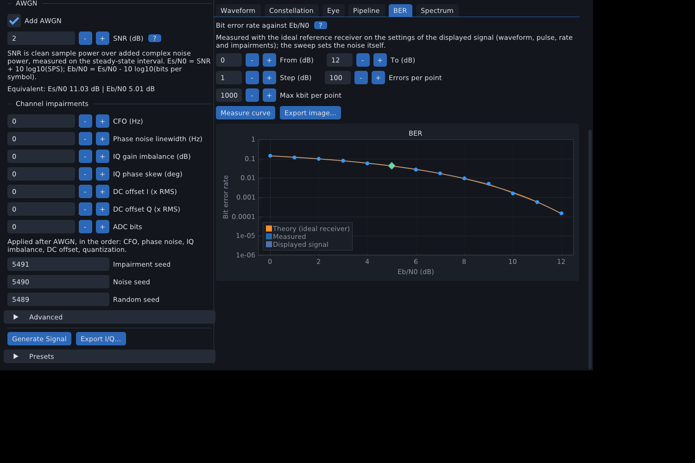

# Bit error rate and the reference receiver

[Back to the README](../README.md)

EVM says how far the received symbols sit from the ideal ones. What a link cares about is how
many **bits** come out wrong. siggen includes an *ideal* hard-decision receiver and the textbook
curves to compare it with, so you can measure BER against Eb/N0, check it against theory and
see where an ideal receiver stops being enough.

## The reference receiver

The receiver is deliberately simple, so that the numbers isolate the channel:

- perfect symbol timing (the decision instants are known);
- the amplitude gain is known;
- the matched filter of the transmit pulse, as for EVM (one RRC span is excluded at each edge);
- **no carrier or phase recovery**.

Coherent schemes decide on the nearest constellation point. Differential schemes (DBPSK,
DQPSK, pi/4-DQPSK, 8-DPSK) decide on the phase step between two consecutive observations, so the
first symbol of a scored range has no decision. Decided labels are compared with the transmitted
bits, giving the bit errors, the bit error rate (BER), and the symbol error rate (SER).

Available for every linear waveform. FSK, MSK and noise sources have no reference receiver yet, so
`siggen ber` rejects them and the GUI hides the BER tab.

Because there is no carrier recovery, a **carrier offset breaks coherent schemes at every
Eb/N0**: the constellation rotates and the decisions spin through all quadrants (BER about
0.5). The differential schemes keep working until the phase rotation per symbol eats their
decision margin: 90 degrees for DBPSK and 45 degrees for DQPSK (250 Hz and 125 Hz at 1000 baud),
slightly earlier in noise. A real receiver adds a carrier recovery loop; that is deliberately not
included here.

## Eb/N0 and the noise setting

A BER curve is drawn against Eb/N0, not against sample-rate SNR, so different modulations and
oversampling factors compare fairly. The generator's SNR relates to it by

```text
Es/N0 = SNR + 10 log10(SPS)          Eb/N0 = Es/N0 - 10 log10(bits per symbol)
SNR_dB = Eb/N0_dB + 10 log10(bits per symbol / SPS)
```

(see [Noise, SNR and channel impairments](noise-and-impairments.md)). `siggen ber`, the GUI
and `siggen.ber_curve` apply this for you.

## Theory curves

`theoretical_ber` (library/theory.h) gives the textbook probability for an ideal receiver over
AWGN, with `Q(x) = erfc(x / sqrt 2) / 2` and `g = Eb/N0` as a ratio:

| Waveform | BER |
|---|---|
| BPSK, QPSK, OQPSK | `Q(sqrt(2g))` (exact; QPSK and OQPSK equal BPSK per bit) |
| 8-PSK | Gray approximation `(2/3) Q(sqrt(6g) sin(pi/8))` |
| 16/64/256-QAM | square-QAM Gray nearest-neighbour approximation |
| 4-PAM, OOK, 4-ASK | Gray-labelled nearest-neighbour expressions for their level spacing |
| DBPSK | `exp(-g) / 2` (exact) |
| DQPSK, pi/4-DQPSK | exact differentially coherent expression with the Marcum Q function (numerical) |
| 8-DPSK, 32-QAM cross, FSK, MSK, WGN | none (`theoretical_ber` is empty; Python returns NaN) |

The approximations are tight above a few dB; at very low Eb/N0 they ignore error events that are
no longer rare. Measured points follow the curves closely; the scatter at low BER is statistics:
a point with 100 errors is good to about 10 %.

## Where it appears

- **Measurements panel (GUI)**: for linear signals, BER, bit errors over bits compared, SER, the
  measured Eb/N0 implied by the EVM, and the textbook BER at that Eb/N0. A single short signal has
  few bits, so the two scatter; the BER tab sweeps many.
- **BER tab (GUI)**: sweep from-to-step in dB with a stopping rule (errors per point, maximum
  kbit per point), run in the background with a Cancel button, drawn on a log axis against the theory
  curve. A point with no error is drawn as an upper bound (BER below 1 / bits). **Export image...**
  saves the plot as PNG or SVG like every other tab. The sweep uses the settings of the displayed
  signal, including its pulse and impairments.

  

- **`siggen ber`**: the same sweep from the command line ([Command line](command-line.md)).
- **`siggen analyze`**: bit errors, BER, measured Eb/N0 and theoretical BER for a recording
  made by siggen, including the interior of batch frames ([Analysis, SigMF and Python](analysis-and-python.md)).
- **Python**: `Signal.bit_errors()`, `siggen.theoretical_ber()` and `siggen.ber_curve()`, with a
  notebook that reproduces the curves.

Sweeps are reproducible: the data, noise and impairment seeds of every block derive from the
configured seeds, the point index and the block index.

## Limits

- Hard decisions only, no coding, no soft metrics.
- No carrier, phase or timing recovery.
- FSK and MSK have no reference receiver; 8-DPSK and 32-QAM have no theory curve.
- Edge symbols (one RRC span at each end) are excluded.
